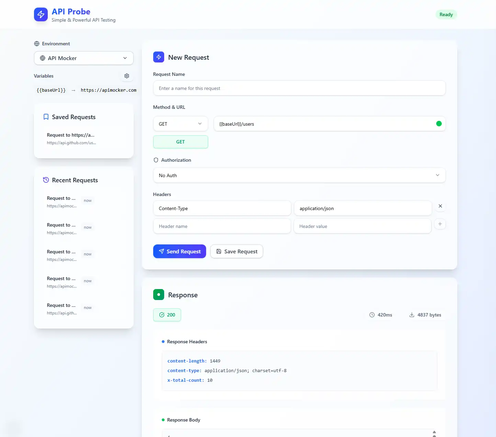

# 🚀 API Probe

A modern, feature-rich API testing tool built with Next.js, TypeScript, and Tailwind CSS. Test your APIs with ease using a beautiful, intuitive interface that rivals Postman.

**🌐 [Live Demo](https://apiprobe.dev)**



## ✨ Features

### 🔧 **Core Functionality**

- **HTTP Methods**: Support for GET, POST, PUT, DELETE, PATCH, HEAD, OPTIONS
- **Request Builder**: Intuitive form-based request creation
- **Response Viewer**: Beautiful JSON/XML response formatting
- **Request History**: Track and replay previous requests
- **Saved Requests**: Save and organize your favorite requests

### 🌍 **Environment Variables**

- **Multiple Environments**: Create different environments (Dev, Staging, Prod)
- **Variable Substitution**: Use `{{variableName}}` syntax in URLs, headers, and body
- **Easy Management**: Visual editor for managing environment variables
- **Persistent Storage**: Variables saved locally for convenience

### 🔐 **Authentication**

- **Bearer Tokens**: Simple bearer token authentication
- **Basic Auth**: Username/password authentication
- **Custom Headers**: Add any custom authorization headers
- **Secure Storage**: Tokens stored securely in local storage

### 📝 **Request Body Support**

- **JSON Editor**: Syntax-highlighted JSON editing
- **XML Support**: Full XML request body support
- **Form Data**: Postman-like key-value pair interface for `application/x-www-form-urlencoded`
- **Raw Text**: Support for plain text and other content types

### 🎨 **User Experience**

- **Modern UI**: Clean, responsive design with Tailwind CSS
- **Keyboard Shortcuts**: Send requests with `Ctrl+Enter`
- **Real-time Validation**: URL validation with environment variable support
- **Response Metrics**: Request duration and response size tracking
- **Error Handling**: Clear error messages and network error handling

## 🚀 Getting Started

### Prerequisites

- Node.js 18+
- npm or yarn

### Installation

1. **Clone the repository**

   ```bash
   git clone https://github.com/yourusername/apiprobe.git
   cd apiprobe
   ```

2. **Install dependencies**

   ```bash
   npm install
   ```

3. **Run the development server**

   ```bash
   npm run dev
   ```

4. **Open your browser**
   Navigate to [http://localhost:3000](http://localhost:3000)

## 📖 Usage Guide

### Making Your First Request

1. **Enter a URL**: Type your API endpoint (e.g., `https://jsonplaceholder.typicode.com/posts`)
2. **Select Method**: Choose the appropriate HTTP method
3. **Add Headers** (optional): Include any required headers
4. **Add Body** (optional): For POST/PUT requests, add your request body
5. **Send**: Click "Send" or press `Ctrl+Enter`

### Using Environment Variables

1. **Create an Environment**:

   - Click the environment dropdown in the left sidebar
   - Click the "+" button to add a new environment
   - Name it (e.g., "Development")

2. **Add Variables**:

   - Click the settings icon next to "Variables"
   - Add key-value pairs (e.g., `baseUrl` = `https://api.example.com`)

3. **Use Variables**:
   - In your URL: `{{baseUrl}}/users`
   - In headers: `Authorization: Bearer {{token}}`
   - In body: `{"userId": {{userId}}}`

### Saving Requests

1. **Send a request** with your desired configuration
2. **Click "Save"** to store it for later use
3. **Access saved requests** from the left sidebar
4. **Load requests** by clicking on them

## 🛠️ Tech Stack

- **Framework**: [Next.js 14](https://nextjs.org/) with App Router
- **Language**: [TypeScript](https://www.typescriptlang.org/)
- **Styling**: [Tailwind CSS](https://tailwindcss.com/)
- **Icons**: [Lucide React](https://lucide.dev/)
- **State Management**: React Hooks
- **Storage**: Local Storage for persistence

## 🏗️ Project Structure

```
apiprobe/
├── src/
│   ├── app/                 # Next.js app router pages
│   ├── components/          # React components
│   │   ├── api/            # API-related components
│   │   └── ui/             # Reusable UI components
│   ├── lib/                # Utility functions and services
│   └── types/              # TypeScript type definitions
├── public/                 # Static assets
└── README.md              # This file
```

## 🎯 Key Components

- **RequestForm**: Main request builder interface
- **ResponseViewer**: Displays API responses with formatting
- **EnvironmentManager**: Manages environment variables
- **RequestHistory**: Shows recent requests
- **SavedRequests**: Manages saved request templates

## 🔧 Development

### Available Scripts

- `npm run dev` - Start development server
- `npm run build` - Build for production
- `npm run start` - Start production server
- `npm run lint` - Run ESLint

### Adding New Features

1. **Create components** in `src/components/`
2. **Add types** in `src/types/`
3. **Update services** in `src/lib/`
4. **Test thoroughly** before committing

## 🤝 Contributing

1. Fork the repository
2. Create a feature branch (`git checkout -b feature/amazing-feature`)
3. Commit your changes (`git commit -m 'Add amazing feature'`)
4. Push to the branch (`git push origin feature/amazing-feature`)
5. Open a Pull Request

## 📝 License

This project is licensed under the MIT License - see the [LICENSE](LICENSE) file for details.

## 🙏 Acknowledgments

- Inspired by Postman and similar API testing tools
- Built with modern web technologies for optimal developer experience
- Designed for simplicity and power

---

**Happy API Testing! 🚀**

If you find this tool helpful, please give it a ⭐ on GitHub!
